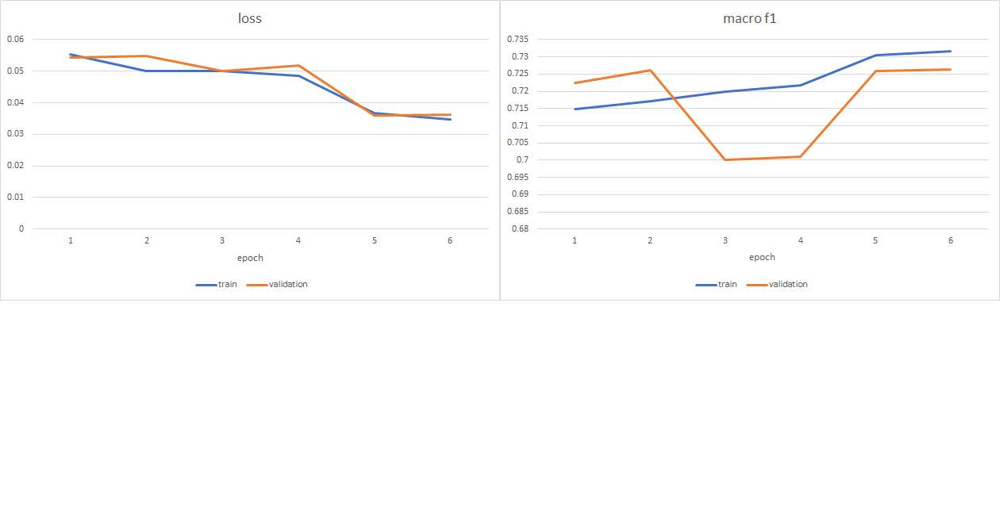

# Evaluating Student Writing
## dataset
[Dataset](https://www.kaggle.com/c/feedback-prize-2021/data) is from a Kaggle competition. Data description can be found there.
## workflow
1. ### EDA
there are three aspects for the data exploration, statistical text analysis, unannotated discourse part, and frequent n-grams per discourse type

2. ### preprocessing
drop those bad essays identified by step one. annotate unclassified text as "nothing"

3. ### modeling
fit the dataset with a smaller BERT model. here is the metric

